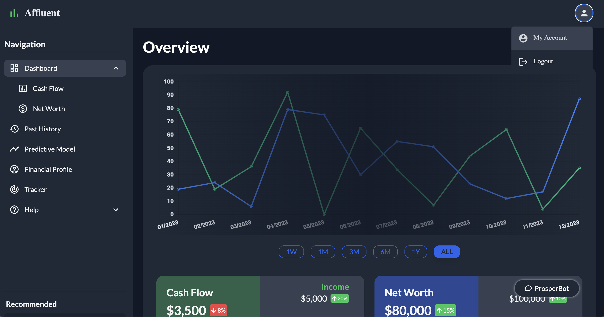
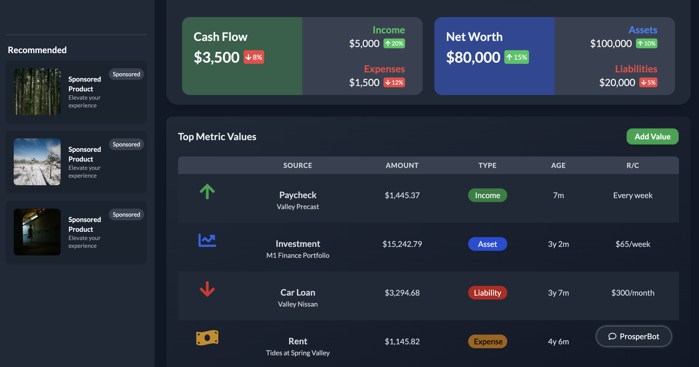
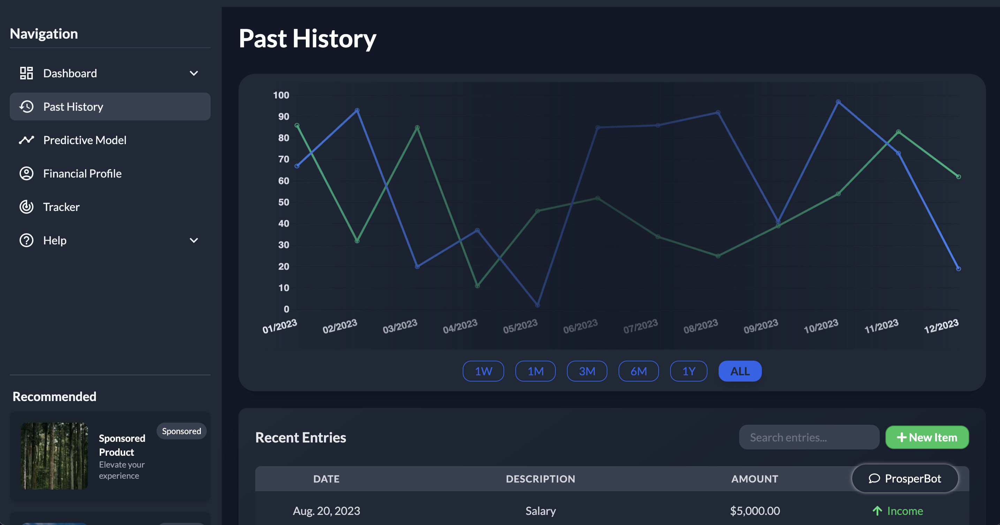
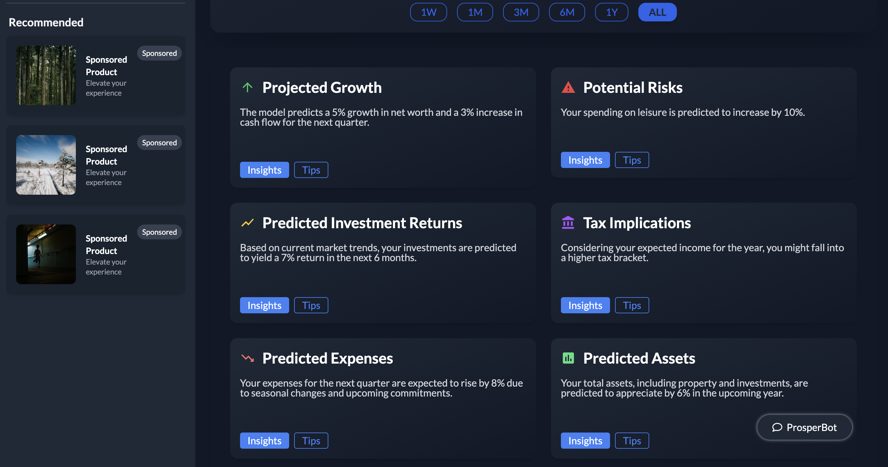
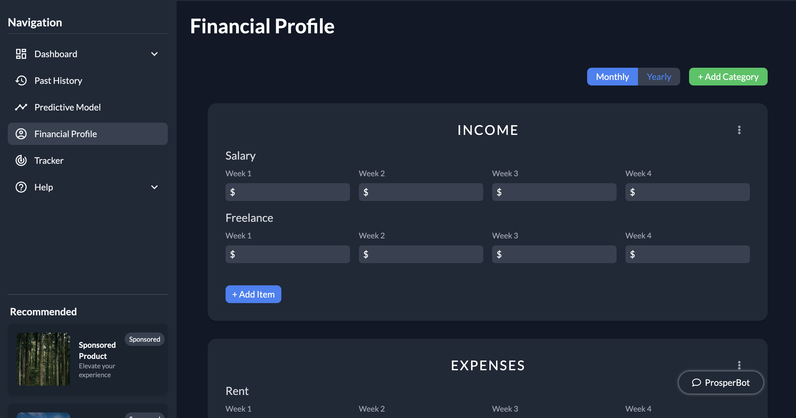
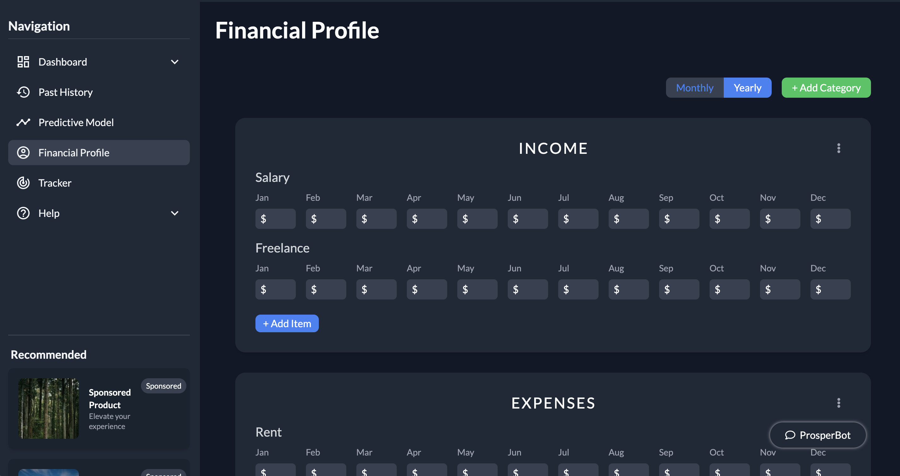
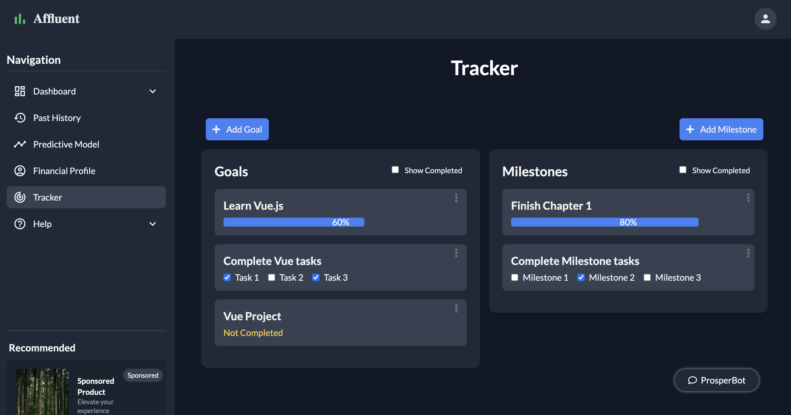
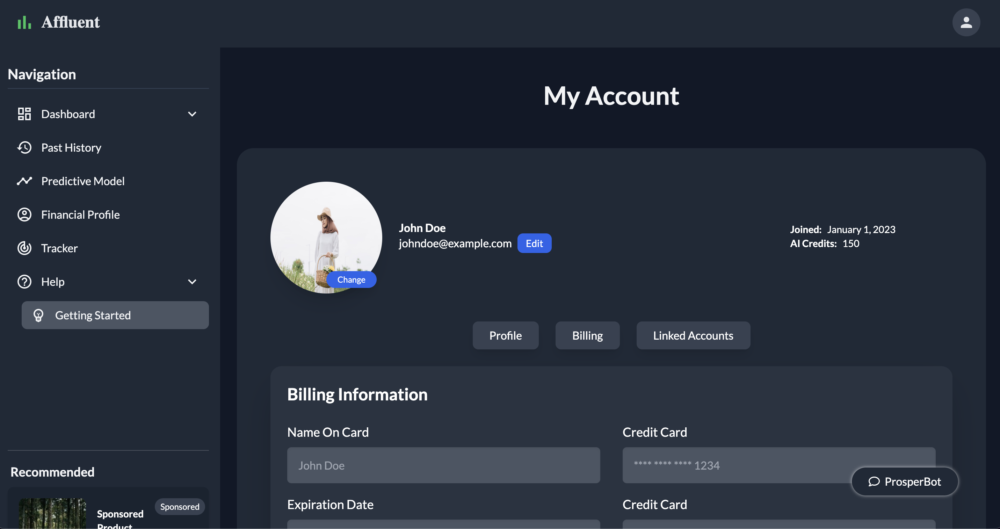

# Affluent

## Disclaimer
**The source code for Affluent is not included in this repository due to its upcoming commercial release. For code review requests from potential employers, recruiters, or collaboration inquiries, please [email me](mailto:dionisggr@gmail.com?subject=Request%20for%20Affluent%20Code%20Walkthrough).**

## What Is It?
Affluent is a cutting-edge, AI-powered personal finance health application that helps users gain a comprehensive understanding of their financial situation. It enables users to input and track various financial data, including assets, liabilities, income, and expenses. The application leverages AI to provide predictive modeling and personalized advice, helping users make informed financial decisions.

## Why Build It?
Affluent was created to fill a gap in the market for a comprehensive tool that addresses all aspects of personal (and commercial) finance. It offers users the ability to experience financial security by providing tools for planning, forecasting, and managing their finances effectively. In a world where financial literacy and planning are key, Affluent aims to empower individuals by offering a clear overview of their financial status and predictive advice for future financial decisions.

## Table of Contents
1. [Features](#features)
2. [Technologies Used](#technologies-used)
3. [Getting Started](#getting-started)
4. [Usage](#usage)
5. [Screenshots](#screenshots)
6. [Challenges and Learnings](#challenges-and-learnings)
7. [Future Enhancements](#future-enhancements)
8. [Contact](#contact)

## Features
- AI-powered predictive modeling for personalized financial advice.
- Comprehensive tracking of net worth through assets and liabilities.
- Visual representations of financial data through interactive charts and graphs.
- Scenario planning for future financial decisions and purchases.
- User-friendly interface with intuitive navigation and data input.

## Technologies Used
Affluent is built with a modern tech stack including: **Vue.js**, **Express**, **TailwindCSS**, and several JavaScript libraries like **axios**, **lodash**, and **chart.js**.

## Getting Started
To run Affluent locally:

```bash
# Clone the repository
git clone https://github.com/dionisggr/affluent.git
cd affluent

# Install dependencies
npm install

# Start the local server
npm start
```

## Usage
### Financial Data Entry
Enter your financial data, including assets, liabilities, income, and expenses, to establish a comprehensive profile.

### Financial Health Overview
View a dashboard summarizing your current financial health, including net worth and cash flow analysis.

### AI-Powered Insights
Receive personalized financial insights and advice based on your data, assisting in making informed financial decisions.

### Tracking and Goal Setting
Utilize tracking features to monitor progress towards financial goals and adjust strategies based on AI recommendations.

## Screenshots










## Challenges and Learnings
Developing the AI model that accurately predicts and provides personalized financial advice was a significant challenge. Integrating various financial data inputs to offer a cohesive user experience was also a learning curve.

## Future Enhancements
- Enhanced AI capabilities for deeper financial insights.
- Integration with banking and financial services for real-time data updates.
- Mobile application development for iOS and Android platforms.
- Expanded features for commercial financial planning and management.

## Contact
For more information or potential collaborations:

- [Portfolio](https://www.dioveloper.com/)
- [LinkedIn](https://www.linkedin.com/in/dionis-gonzalez/)
- [Email](dionisggr@gmail.com)
```